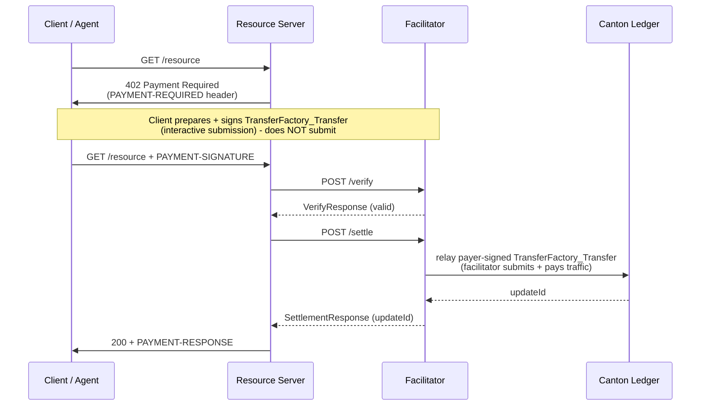

The [x402 protocol](https://x402.org) turns the `402 Payment Required` status code into a payment flow: a server returns payment requirements, the client pays on-chain and retries, and the payment itself is the credential. No API keys, no billing accounts.

On Canton, x402 uses the `exact` scheme with the `transfer-factory` settlement method (a CIP-56 Token Standard transfer). The client signs a `TransferFactory_Transfer` naming the merchant as receiver but does **not** submit it; the facilitator relays the signed transfer and pays the traffic fee, and because the merchant holds a standing `TransferPreapproval` it settles directly to the merchant in one transaction. No escrow, no lock step, no facilitator custody. Canton Coin and any CIP-56 registry token (e.g. USDCx) share this flow, differing only by the instrument (`extra.instrumentId`).

> **Source of truth:** the normative payload structure and verification rules live in the merged x402 spec, [`scheme_exact_canton.md`](https://github.com/x402-foundation/x402/blob/main/specs/schemes/exact/scheme_exact_canton.md). This page is the FTP usage guide.

## The flow



The facilitator is the sole submitter: it relays the payer-signed transfer and pays only the sequencer traffic. It signs nothing on the payer's behalf and never holds custody. The funds move from the payer's own holdings, and the merchant's `TransferPreapproval` is what makes the transfer resolve directly.

## The `exact` scheme

| Field | Value |
|---|---|
| `scheme` | `exact` |
| `asset` | `CC` (Canton Coin) or a registry token symbol (e.g. `USDCx`) |
| `assetTransferMethod` | `transfer-factory` |
| Networks | `canton:mainnet`, `canton:testnet` |

### PaymentRequirements

```json
{
  "scheme": "exact",
  "network": "canton:mainnet",
  "amount": "10000000000",
  "asset": "CC",
  "payTo": "<receiver-party>::1220...",
  "maxTimeoutSeconds": 60,
  "extra": {
    "assetTransferMethod": "transfer-factory",
    "feePayer": "<facilitator-party>::1220...",
    "synchronizerId": "global-domain::1220...",
    "instrumentId": { "admin": "<DSO-party>::1220...", "id": "Amulet" },
    "executeBeforeSeconds": 120,
    "memo": "invoice-2024-001"
  }
}
```

- `amount`: integer string of atomic units (1 CC = 10^10 units), so `"10000000000"` = 1 CC. Compared by value.
- `feePayer`: the facilitator party (the relayer). Clients MUST NOT alter it.
- `instrumentId`: the token, authoritative over `asset` (a display symbol). CC is `{ admin: "<DSO-party>", id: "Amulet" }`; a registry token is `{ admin: "<registrar>", id: "<instrument-id>" }`.
- `executeBeforeSeconds`: relative deadline (seconds from request time) for the transfer's absolute `executeBefore`.
- `memo` (optional): a client-stamped tag; not validated by the facilitator.

> `feePayer`, `synchronizerId`, and `instrumentId.admin` are deployment values. Get `feePayer` and `synchronizerId` from `GET /supported`; get the DSO party from your Canton Scan API.

## The facilitator

A facilitator bridges x402 and the Canton ledger. It relays the payer-signed `TransferFactory_Transfer` - submitting the transaction, paying the traffic fee, and resolving the transfer's execution context from the registry as disclosed contracts. It exposes two endpoints the resource server calls:

- `POST /verify` - validates the signed transfer against `PaymentRequirements` (no ledger write)
- `POST /settle` - relays the signed transfer and returns the ledger `updateId`

`GET /supported` returns its party id, method, and networks:

```json
{
  "kinds": [{
    "x402Version": 2,
    "scheme": "exact",
    "network": "canton:mainnet",
    "extra": {
      "transferMethods": ["transfer-factory"],
      "synchronizerId": "global-domain::1220..."
    }
  }],
  "signers": { "canton:*": ["<facilitator-party>::1220..."] }
}
```

Because `/supported` advertises `synchronizerId`, a 402 `extra` MAY omit it. `transfer-factory` runs through the standard CIP-56 `:TransferInstruction` interface, so there is no custom DAR for merchants to install.

## Replay protection

Replay protection is native and on-ledger. The payer-signed transfer names specific input holdings; once it executes those holdings are consumed, so resubmitting the same payload references already-spent holdings and the ledger rejects it. A facilitator MUST **relay** the signed transfer to settle; it MUST NOT treat a previously observed `updateId` as settlement, since reading a completed update is replayable and moves no funds.

## Error codes

| Code | Meaning |
|---|---|
| `invalid_exact_canton_missing_proof` | Payload does not carry the payer-signed submission (`preparedTransaction` / `preparedTxHash` / `signature`) |
| `invalid_exact_canton_malformed_payload` | `preparedTransaction` is not valid base64 / a single gzip member, or exceeds the size bounds |
| `invalid_exact_canton_signature_invalid` | The submission is not validly signed by the payer over `preparedTxHash` |
| `invalid_exact_canton_amount_mismatch` | Transfer amount ≠ `PaymentRequirements.amount` (by value) |
| `invalid_exact_canton_merchant_mismatch` | Transfer receiver ≠ `payTo` |
| `invalid_exact_canton_instrument_id_mismatch` | Transfer instrument does not match `extra.instrumentId` |
| `invalid_exact_canton_preapproval_missing` | Merchant holds no live `TransferPreapproval`, so the transfer would not settle in one transaction |
| `invalid_exact_canton_fee_payer_mismatch` | `extra.feePayer` ≠ the facilitator's own party |
| `invalid_exact_canton_expired` | `executeBefore` is past or within the safety margin |
| `invalid_exact_canton_self_payment` | The proven sender is the facilitator / fee payer |
| `invalid_exact_canton_execute_failed` | The relayed transfer was rejected on execution (an input holding was already spent, or funds were insufficient). Transient contention SHOULD be retried |
| `unexpected_canton_ledger_error` | Network mismatch, missing preapproval, or a Scan/ledger error not covered above |

## Next steps

<CardGroup cols={2}>
  <Card title="Merchant integration" icon="store" href="/x402-merchant">
    Charge CC or a CIP-56 token on your Express or Next.js API.
  </Card>
  <Card title="Agent integration" icon="robot" href="/x402-agent">
    Pay x402-gated endpoints from an agent or backend.
  </Card>
</CardGroup>
